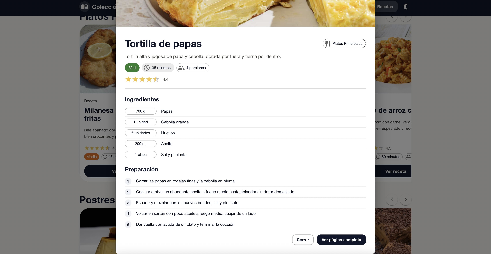

# Aplicación de Recetas

Catálogo de recetas con vista de listado y detalle completo, diseñado para explorar platos de forma rápida con una interfaz moderna y adaptable a distintos dispositivos.

## Tecnologías utilizadas
- React 19.1.1
- React Router DOM 7.8.2
- Material-UI 7.3.2
- Vite

## Instalación
1. Clonar el repositorio.
2. Instalar dependencias:
   ```bash
   npm install
   ```
3. Ejecutar el proyecto en modo desarrollo:
   ```bash
   npm run dev
   ```
4. Abrir en el navegador: `http://localhost:5173`

## Estructura del Proyecto
```
src/
├── components/
│   ├── layout/Navbar.jsx
│   └── recetas/
│       ├── IngredientesList.jsx
│       ├── RecetaCard.jsx
│       ├── RecetaDetalle.jsx
│       └── RecetasList.jsx
├── contexts/RecetasContext.jsx
├── data/recetas.json
├── pages/
│   ├── RecetaDetallePage.jsx
│   └── RecetasListPage.jsx
├── App.jsx
└── main.jsx
```

## Funcionalidades
- Listado de recetas con tarjetas adaptables y chips informativos.
- Detalle de receta con ingredientes, pasos numerados y botón para volver.
- Navegación entre páginas con React Router DOM.
- Manejo de estado global con Context API, estados de carga y de error.
- Copiado rápido del enlace de la receta desde el detalle.
- Buscador, filtro por dificultad y vista de favoritos (localStorage).
- Marcado de favoritos desde las tarjetas y botón para compartir.
- Página 404 y pantalla de inicio simple.

## Scripts Disponibles
- `npm run dev`: modo desarrollo.
- `npm run build`: build de producción.
- `npm run preview`: vista previa del build.
- `npm run lint`: análisis estático con ESLint.

## Capturas de pantalla
```



```

